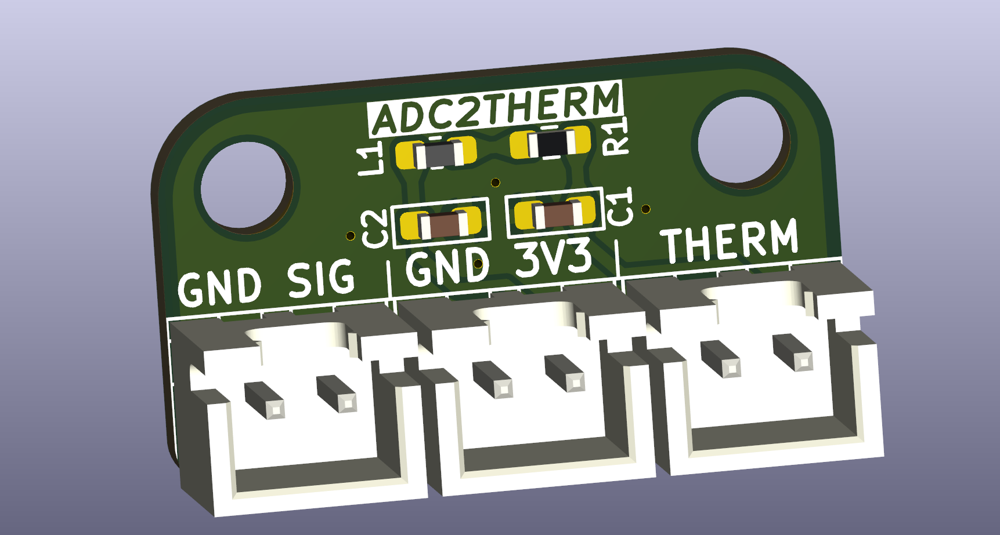
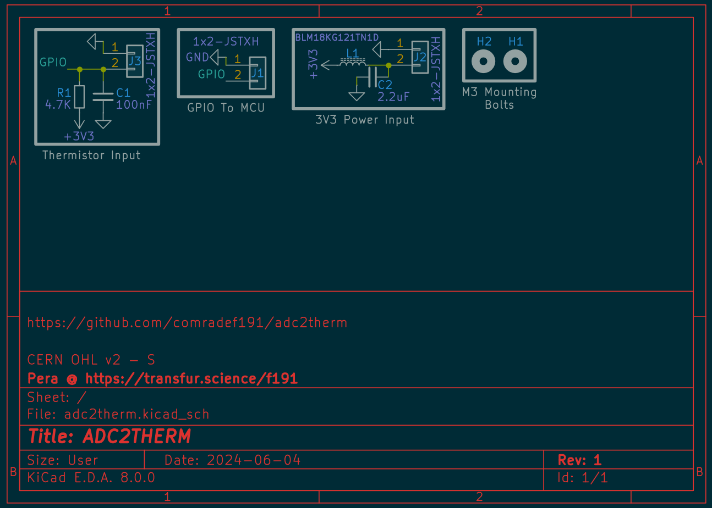

# ATTENTION: ACTUAL PCBS NOT YET TESTED
**MY PCBS HAVE NOT YET ARRIVIED, THUS I HAVE NOT YET BEEN ABLE TO TEST THIS BOARD AND ITS STABILITY. FEEL FREE TO JOIN MY [DISCORD](https://discord.gg/cMK9gxetGT) FOR UPDATES; THIS NOTICE WILL BE REMOVED ONCE MY BOARDS ARRIVE AND I AM ABLE TO PERFORM SOME TESTING.**
___

# About
This is a simple PCB implementing the support circuitry necessery to properly connect a Thermistor to an ADC pin.

While originally intended to be used with the [SKR Pico](https://bttwiki.com/SKR%20Pico.html)'s `SERVO` port to add a port for a chamber thermistor, this board should have universal compatability.

It should be noted that this board uses 0603 SMD components, and as such hand-assembly may be more tricky to novices, though I have made sure to use the enlarged hand-assembly footprints.

___
# Bill Of Materials
| Component          |No. Needed|Cost (Total)|Comment|Sourcing URL|
|--------------------|----------|------------|-------|-------|
|JST XH 1x2          | 3        | $0.65      |MoQ=100|https://www.lcsc.com/product-detail/Wire-To-Board-Connector_DEALON-XH-D-2A_C5160911.html|
|Ferrite Bead        | 1        | $0.51      |MoQ=50 |https://www.lcsc.com/product-detail/Ferrite-Beads_Murata-Electronics-BLM18KG121TN1D_C85831.html|
|4.7k 0.1% Resistor  | 1        | $0.84      |MoQ=50 |https://www.lcsc.com/product-detail/Chip-Resistor-Surface-Mount_UNI-ROYAL-Uniroyal-Elec-TC0350B4701T5F_C2989672.html|
|100nF 10v Capacitor | 1        | $0.31      |MoQ=100|https://www.lcsc.com/product-detail/Multilayer-Ceramic-Capacitors-MLCC-SMD-SMT_YAGEO-CC0603KRX7R6BB104_C519438.html|
|2.2uF 10v Capacitor | 1        | $0.43      |MoQ=100|https://www.lcsc.com/product-detail/Multilayer-Ceramic-Capacitors-MLCC-SMD-SMT_Samwha-Capacitor-CS1608X5R225K100NRB_C5189830.html|

MoQ cost of $2.74. This is enough for 30 PCBs, making for $0.09 in parts per board, before shipping, tax and PCB costs.

The cost for 75 boards, Including shipping, PCBs, and parts, is aprox $23.31 and £0.31 per board

___
# LICENSE
This source describes Open Hardware and is licensed under the CERN-OHL-S v2 or any later version.
You may redistribute and modify this source and make products using it under the terms of the CERN-OHL-S v2. (https://ohwr.org/cern_ohl_s_v2.txt)

This source is distributed WITHOUT ANY EXPRESS OR IMPLIED WARRANTY, INCLUDING OF MERCHANTABILITY, SATISFACTORY QUALITY AND FITNESS FOR A PARTICULAR PURPOSE. Please see the CERN-OHL-S v2 for applicable conditions.

Source location: https://github.com/comradef191/adc2therm

As per CERN-OHL-S v2 section 4, should You produce hardware based on this source, You must where practicable maintain the Source Location visible on the PCB.

___

*I would like to give thanks to @dead.lock for providing feedback on my analogue layout.*
